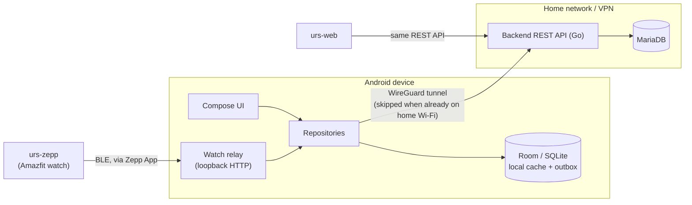
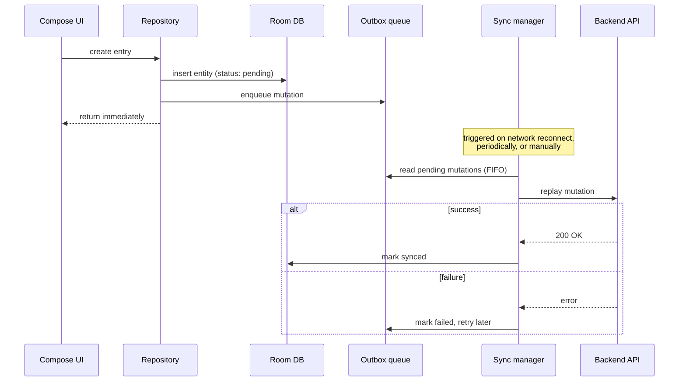

# Architecture

A technical overview of how the urs app family fits together — this
client, its backend, and how data flows between them. Complements the
permissions/feature notes in `README.md` rather than repeating them.

## System overview

urs is a household app family split across several repositories:

- **This repo (`urs-android`)** — the primary, offline-capable client,
  native Kotlin/Compose.
- **[urs-web](https://github.com/3lefeint/urs-web)** — a browser
  companion (React/TypeScript) for tasks awkward on a phone, thin
  client, home-network only.
- **[urs-zepp](https://github.com/3lefeint/urs-zepp)** — a Zepp OS
  mini-app for Amazfit watches, for quick logging from the wrist. It
  has no network access or login session of its own — this app relays
  its requests (see "Watch companion relay" below).
- **A private, self-hosted backend** — a Go REST API backed by
  MariaDB, deployed on Kubernetes. Never exposed to the public
  internet; see "Network reachability" below. Code lives on
  self-hosted GitLab, not on GitHub — the public
  [urs-backend](https://github.com/3lefeint/urs-backend) repo is only
  an issue tracker for it.

## Authentication

Login is JWT-based: a short-lived access token plus a refresh token,
obtained via `/api/v1/login` and renewed via `/api/v1/refresh`. The
access token is attached to API requests by an OkHttp interceptor
(`AuthInterceptor`) and auto-refreshed on expiry (`AuthAuthenticator`).
Tokens are stored encrypted on-device (`security/KeystoreCipher.kt`,
Android Keystore-backed). An optional biometric gate
(`auth/BiometricGate.kt`) can require a fingerprint/face unlock before
the app content is shown, independent of the login session itself.

## Network reachability

The backend is never reachable from the public internet — only from
the home network, or through a WireGuard VPN tunnel the app can bring
up itself. The app checks the connected Wi-Fi SSID to recognize when
it's already on the home network and skips the tunnel in that case;
otherwise it establishes the tunnel on demand before syncing.

## Watch companion relay

`urs-zepp` runs on hardware with no direct internet access and no
login session of its own. Its side service (running inside the Zepp
App on the paired phone) talks to a loopback-only HTTP relay this app
exposes (`watchrelay/WatchRelayService.kt`, a foreground service) —
authenticated with a locally-generated relay token, not the user's own
login. The relay forwards requests (logging a beer, listing chore
types, uploading a chunked audio note — transcoded from Opus to Ogg
before upload) to the real backend using this app's own authenticated
session, then relays the response back.

## Offline-first data flow

Most write-capable features (fuel fill-ups, work-time entries,
inventories/inventory products, shopping lists/list items, notes,
chores, kanban boards/columns/cards) are built offline-first: a write
is never blocked on live network reachability. The shared product
catalog (`catalog_product`/`catalog_category`) and "recently used
products" are the exception — read-only, server-authoritative reference
data cached locally but never written to offline.

- A write lands in Room immediately; a matching outbox row records the
  mutation as serialized JSON.
- A sync manager replays outbox rows against the backend in order,
  marking each synced or failed — one failure doesn't block later rows.
- Sync fires opportunistically on network reconnect, periodically as a
  background job, and on manual request. A lightweight reachability
  check precedes every sync attempt. Data is also pulled from the
  server proactively (on reachability, periodic sync, and manual sync)
  so a fresh install or a post-migration wipe doesn't sit empty until
  every screen happens to be opened.
- Reads are served from the local cache first, refreshed
  opportunistically whenever the backend is reachable.
- For a handful of update paths (list/list-item/inventory-product), the
  backend resolves concurrent offline edits last-write-wins via an
  explicit `updated_at` basis timestamp from the client, rather than
  whichever write happens to sync first. Most other domains don't need
  this yet — realistic conflicts are rare for a single/few-device
  household.

Not every feature uses this pattern yet; newer or lower-stakes
features may still call the API directly without local caching.

## Backend conventions

- Go REST API, MariaDB, schema managed with versioned migrations
  (up/down pairs, `goose`).
- One data-access file per domain, plain SQL (no ORM), a context
  timeout on every query.
- Every table carries `created_at`/`updated_at` timestamps; optional
  fields are nullable in the database and serialized as empty strings
  over the wire.
- Endpoints are versioned (`/api/v1/...`), JSON request/response
  bodies, plural-noun resource paths.
- Deployed on Kubernetes; a super-user-only admin endpoint can trigger
  its own log-level changes and restarts at runtime.
