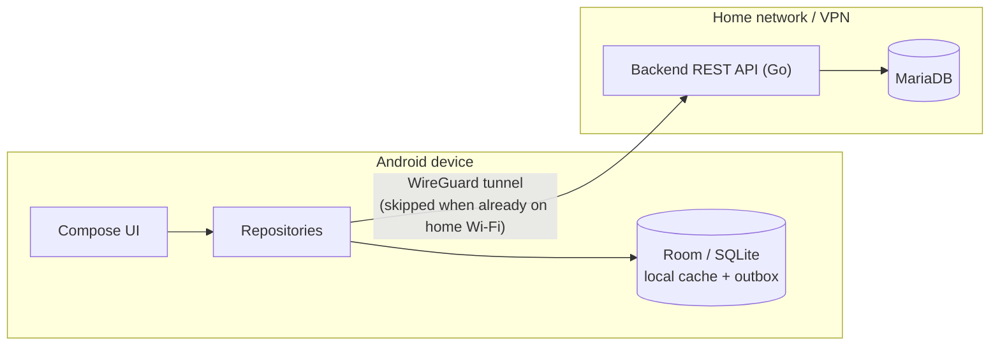
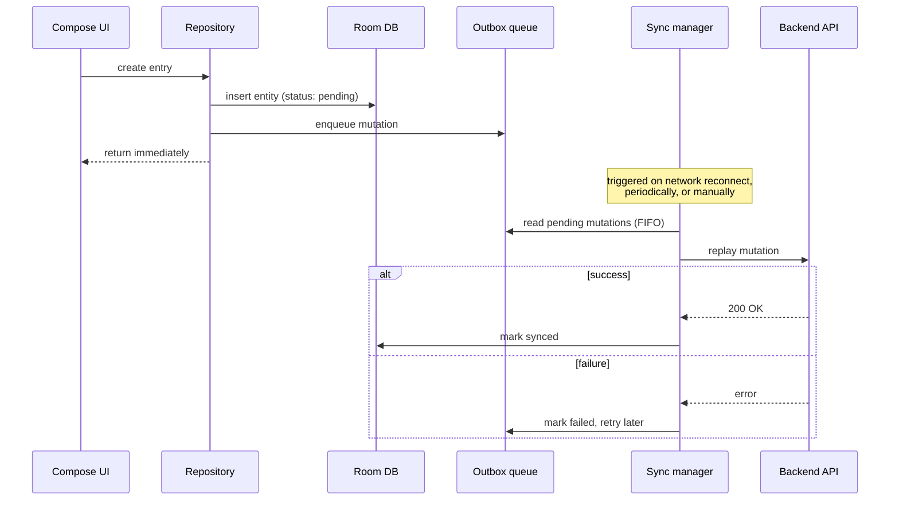

# Architecture

A technical overview of how the urs app family fits together — this
client, its backend, and how data flows between them. Complements the
permissions/setup notes in `README.md` rather than repeating them.

## System overview

urs is a household app split across three repositories:

- **This repo (`urs-android`)** — the active client, native
  Kotlin/Compose.
- **A private, self-hosted backend** — a Go REST API backed by
  MariaDB. Never exposed to the public internet; see "Network
  reachability" below.
- **A legacy Vue 3 web app** — a reference implementation only, being
  replaced feature by feature by this app.

## Network reachability

The backend is never reachable from the public internet — only from
the home network, or through a WireGuard VPN tunnel the app can bring
up itself. The app checks the connected Wi-Fi SSID to recognize when
it's already on the home network and skips the tunnel in that case;
otherwise it establishes the tunnel on demand before syncing.

## Offline-first data flow

Some features (currently: fuel fill-ups, work-time entries, inventories/
inventory products, shopping lists/list items) are built offline-first: a
write is never blocked on live network reachability. The shared product
catalog (`catalog_product`/`catalog_category`) and "recently used
products" are the exception — read-only, server-authoritative reference
data cached locally but never written to offline.

- A write lands in Room immediately; a matching outbox row records the
  mutation as serialized JSON.
- A sync manager replays outbox rows against the backend in order,
  marking each synced or failed — one failure doesn't block later rows.
- Sync fires opportunistically on network reconnect, periodically as a
  background job, and on manual request. A lightweight reachability
  check precedes every sync attempt.
- Reads are served from the local cache first, refreshed
  opportunistically whenever the backend is reachable.
- No conflict resolution exists — acceptable for a single-user,
  single-device write path.

Not every feature uses this pattern yet; newer or lower-stakes
features may still call the API directly without local caching.

## Backend conventions

- Go REST API, MariaDB, schema managed with versioned migrations
  (up/down pairs).
- One data-access file per domain, plain SQL (no ORM), a context
  timeout on every query.
- Every table carries `created_at`/`updated_at` timestamps; optional
  fields are nullable in the database and serialized as empty strings
  over the wire.
- Endpoints are versioned (`/api/v1/...`), JSON request/response
  bodies, plural-noun resource paths.

## Current limitations

- No authentication or per-user data ownership exists yet — most data
  is shared across the household rather than scoped to an individual.
  A few tables (e.g. work-time entries) already carry a `user_id`
  column and use it for real, but the client currently hardcodes a
  single user id rather than deriving it from a login — a placeholder
  until real authentication exists.
- Conflict resolution for offline sync is intentionally out of scope
  while usage stays single-device per household member.
